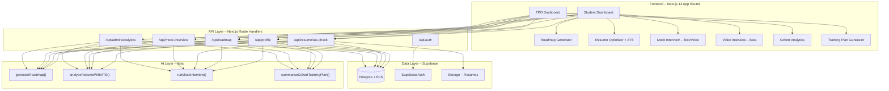

# Placemate AI – Implementation Plan

## System Architecture Overview

Placemate AI is a **multi-tenant AI-first SaaS platform** designed for tier-2/3 engineering colleges to improve student placements. The architecture follows a clean vertical-slice pattern optimized for a 48-hour hackathon.



### Key Architectural Decisions

| Decision | Choice | Rationale |
|----------|--------|-----------|
| Frontend | Next.js 14 App Router + TypeScript | Required by hackathon; SSR for SEO, API routes in same codebase |
| UI Library | **shadcn/ui + Watermelon UI registry** | Watermelon UI is a shadcn-based registry (installed via `npx shadcn@latest add <registry-url>`) with Tailwind CSS v4 |
| Database/Auth | Supabase (Postgres + RLS) | Free tier, built-in auth, real-time, Row-Level Security for multi-tenancy |
| AI | Google Gemini API (or OpenAI) | General-purpose LLM with structured JSON output via prompt engineering |
| PDF Parsing | `pdf-parse` (server-side) | Lightweight, no external APIs needed |
| Styling | Tailwind CSS v4 + tw-animate-css | Required by Watermelon UI; modern utility-first CSS |

---

## User Review Required

> [!IMPORTANT]
> **Which LLM provider do you want to use?** The plan uses Google Gemini (free generous tier) as default. OpenAI GPT-4o is also supported. Please confirm or specify your API key provider.

> [!IMPORTANT]
> **Supabase project**: Do you already have a Supabase project created, or should I set up the schema for manual creation? Please share your Supabase URL and anon key if available.

> [!WARNING]
> **Watermelon UI compatibility**: Watermelon UI requires **Tailwind CSS v4** and **React 19**. Next.js 14 uses React 18 by default. We have two options:
> 1. Use **Next.js 15** (which supports React 19) – recommended for Watermelon UI compatibility
> 2. Stick with **Next.js 14** and use shadcn/ui directly (without Watermelon registry) – safer but fewer bonus points
>
> **Recommendation**: Use **Next.js 15 (App Router)** with React 19 for full Watermelon UI support. Please confirm.

> [!IMPORTANT]
> **TruGen AI**: Do you have a TruGen API key and Agent ID? If not, we'll build the core text+webcam interview and add the TruGen iframe as a pluggable feature.

---

## Database Schema

### SQL Schema (Supabase/Postgres)

```sql
-- ============================================================
-- 1. INSTITUTES (multi-tenant root)
-- ============================================================
CREATE TABLE institutes (
  id          UUID PRIMARY KEY DEFAULT gen_random_uuid(),
  name        TEXT NOT NULL,
  slug        TEXT UNIQUE NOT NULL,
  logo_url    TEXT,
  created_at  TIMESTAMPTZ DEFAULT now()
);

-- ============================================================
-- 2. USERS (linked to Supabase Auth)
-- ============================================================
CREATE TYPE user_role AS ENUM ('student', 'tpo', 'admin');

CREATE TABLE users (
  id            UUID PRIMARY KEY DEFAULT gen_random_uuid(),
  auth_id       UUID UNIQUE NOT NULL REFERENCES auth.users(id) ON DELETE CASCADE,
  institute_id  UUID NOT NULL REFERENCES institutes(id) ON DELETE CASCADE,
  role          user_role NOT NULL DEFAULT 'student',
  email         TEXT NOT NULL,
  full_name     TEXT,
  avatar_url    TEXT,
  created_at    TIMESTAMPTZ DEFAULT now()
);

CREATE INDEX idx_users_institute ON users(institute_id);
CREATE INDEX idx_users_auth ON users(auth_id);

-- ============================================================
-- 3. PROFILES (student-specific data)
-- ============================================================
CREATE TABLE profiles (
  user_id         UUID PRIMARY KEY REFERENCES users(id) ON DELETE CASCADE,
  branch          TEXT,                          -- e.g., 'CSE', 'IT', 'ECE'
  semester        INT CHECK (semester BETWEEN 1 AND 8),
  cgpa_band       TEXT,                          -- e.g., '7.0-8.0', '8.0-9.0'
  target_role     TEXT,                          -- e.g., 'SDE', 'Web Dev', 'Data Analyst'
  skills_json     JSONB DEFAULT '[]'::jsonb,     -- [{name: "DSA", level: 3}, ...]
  hours_per_week  INT DEFAULT 10,
  onboarding_done BOOLEAN DEFAULT false,
  updated_at      TIMESTAMPTZ DEFAULT now()
);

-- ============================================================
-- 4. ROADMAPS (AI-generated career plans)
-- ============================================================
CREATE TABLE roadmaps (
  id              UUID PRIMARY KEY DEFAULT gen_random_uuid(),
  user_id         UUID NOT NULL REFERENCES users(id) ON DELETE CASCADE,
  institute_id    UUID NOT NULL REFERENCES institutes(id),
  plan_json       JSONB NOT NULL,                -- weekly plan structure
  duration_months INT DEFAULT 3,
  status          TEXT DEFAULT 'active',          -- active | archived
  created_at      TIMESTAMPTZ DEFAULT now(),
  updated_at      TIMESTAMPTZ DEFAULT now()
);

CREATE INDEX idx_roadmaps_user ON roadmaps(user_id);

-- ============================================================
-- 5. ROADMAP_PROGRESS (track weekly completion)
-- ============================================================
CREATE TABLE roadmap_progress (
  id          UUID PRIMARY KEY DEFAULT gen_random_uuid(),
  roadmap_id  UUID NOT NULL REFERENCES roadmaps(id) ON DELETE CASCADE,
  user_id     UUID NOT NULL REFERENCES users(id) ON DELETE CASCADE,
  week_number INT NOT NULL,
  completed   BOOLEAN DEFAULT false,
  notes       TEXT,
  updated_at  TIMESTAMPTZ DEFAULT now(),
  UNIQUE(roadmap_id, week_number)
);

-- ============================================================
-- 6. RESUME_FEEDBACK (ATS analysis results)
-- ============================================================
CREATE TABLE resume_feedback (
  id                      UUID PRIMARY KEY DEFAULT gen_random_uuid(),
  user_id                 UUID NOT NULL REFERENCES users(id) ON DELETE CASCADE,
  institute_id            UUID NOT NULL REFERENCES institutes(id),
  raw_resume_text         TEXT NOT NULL,
  target_role             TEXT,
  job_description         TEXT,
  ats_score               INT CHECK (ats_score BETWEEN 0 AND 100),
  parsed_json             JSONB,          -- {name, summary, skills, education, experience, projects}
  strengths_json          JSONB,          -- ["Strong project descriptions", ...]
  weaknesses_json         JSONB,          -- ["Missing keywords for SDE role", ...]
  improvement_actions_json JSONB,         -- ["Add X keyword", "Quantify Y achievement", ...]
  improved_resume_text    TEXT,
  created_at              TIMESTAMPTZ DEFAULT now()
);

CREATE INDEX idx_resume_feedback_user ON resume_feedback(user_id);

-- ============================================================
-- 7. MOCK_INTERVIEWS (text + voice sessions)
-- ============================================================
CREATE TYPE interview_mode AS ENUM ('text', 'video_beta');
CREATE TYPE interview_status AS ENUM ('in_progress', 'completed', 'abandoned');

CREATE TABLE mock_interviews (
  id                  UUID PRIMARY KEY DEFAULT gen_random_uuid(),
  user_id             UUID NOT NULL REFERENCES users(id) ON DELETE CASCADE,
  institute_id        UUID NOT NULL REFERENCES institutes(id),
  mode                interview_mode DEFAULT 'text',
  status              interview_status DEFAULT 'in_progress',
  target_role         TEXT,
  transcript_json     JSONB DEFAULT '[]'::jsonb,   -- [{role, content, timestamp}, ...]
  question_scores_json JSONB DEFAULT '[]'::jsonb,  -- [{question_index, score, feedback}, ...]
  overall_score       INT CHECK (overall_score BETWEEN 0 AND 100),
  summary             TEXT,
  strengths           JSONB,
  weaknesses          JSONB,
  created_at          TIMESTAMPTZ DEFAULT now(),
  completed_at        TIMESTAMPTZ
);

CREATE INDEX idx_mock_interviews_user ON mock_interviews(user_id);

-- ============================================================
-- 8. TPO_TRAINING_PLANS (cohort-level AI plans)
-- ============================================================
CREATE TABLE tpo_training_plans (
  id              UUID PRIMARY KEY DEFAULT gen_random_uuid(),
  institute_id    UUID NOT NULL REFERENCES institutes(id),
  created_by      UUID NOT NULL REFERENCES users(id),
  filters_json    JSONB,             -- {batch, branch, year}
  cohort_stats    JSONB,             -- aggregated anonymised data
  plan_json       JSONB NOT NULL,    -- weekly training program
  created_at      TIMESTAMPTZ DEFAULT now()
);

-- ============================================================
-- 9. ACTIVITY_LOG (audit trail)
-- ============================================================
CREATE TABLE activity_log (
  id          UUID PRIMARY KEY DEFAULT gen_random_uuid(),
  user_id     UUID NOT NULL REFERENCES users(id),
  action      TEXT NOT NULL,          -- 'roadmap_generated', 'resume_analyzed', etc.
  metadata    JSONB,
  created_at  TIMESTAMPTZ DEFAULT now()
);

CREATE INDEX idx_activity_log_user ON activity_log(user_id);
```

### Row-Level Security (RLS) Policies

```sql
-- Enable RLS on all tables
ALTER TABLE users ENABLE ROW LEVEL SECURITY;
ALTER TABLE profiles ENABLE ROW LEVEL SECURITY;
ALTER TABLE roadmaps ENABLE ROW LEVEL SECURITY;
ALTER TABLE resume_feedback ENABLE ROW LEVEL SECURITY;
ALTER TABLE mock_interviews ENABLE ROW LEVEL SECURITY;
ALTER TABLE roadmap_progress ENABLE ROW LEVEL SECURITY;
ALTER TABLE tpo_training_plans ENABLE ROW LEVEL SECURITY;

-- Helper function: get current user's institute
CREATE OR REPLACE FUNCTION get_user_institute_id()
RETURNS UUID AS $$
  SELECT institute_id FROM users WHERE auth_id = auth.uid()
$$ LANGUAGE sql SECURITY DEFINER STABLE;

-- Helper function: get current user's role
CREATE OR REPLACE FUNCTION get_user_role()
RETURNS user_role AS $$
  SELECT role FROM users WHERE auth_id = auth.uid()
$$ LANGUAGE sql SECURITY DEFINER STABLE;

-- USERS: students see own row; TPO/admin see institute users
CREATE POLICY "users_own" ON users FOR SELECT
  USING (auth_id = auth.uid());
CREATE POLICY "users_institute" ON users FOR SELECT
  USING (
    institute_id = get_user_institute_id()
    AND get_user_role() IN ('tpo', 'admin')
  );

-- PROFILES: students own; TPO can read institute profiles
CREATE POLICY "profiles_own" ON profiles FOR ALL
  USING (user_id = (SELECT id FROM users WHERE auth_id = auth.uid()));
CREATE POLICY "profiles_tpo_read" ON profiles FOR SELECT
  USING (
    user_id IN (SELECT id FROM users WHERE institute_id = get_user_institute_id())
    AND get_user_role() IN ('tpo', 'admin')
  );

-- ROADMAPS, RESUME_FEEDBACK, MOCK_INTERVIEWS: similar pattern
-- Students: own data only. TPO: read-only institute data.
CREATE POLICY "roadmaps_own" ON roadmaps FOR ALL
  USING (user_id = (SELECT id FROM users WHERE auth_id = auth.uid()));
CREATE POLICY "roadmaps_tpo" ON roadmaps FOR SELECT
  USING (institute_id = get_user_institute_id() AND get_user_role() IN ('tpo', 'admin'));

CREATE POLICY "resume_own" ON resume_feedback FOR ALL
  USING (user_id = (SELECT id FROM users WHERE auth_id = auth.uid()));

CREATE POLICY "interviews_own" ON mock_interviews FOR ALL
  USING (user_id = (SELECT id FROM users WHERE auth_id = auth.uid()));

-- TPO TRAINING PLANS: TPO/admin of same institute
CREATE POLICY "training_plans_institute" ON tpo_training_plans FOR ALL
  USING (institute_id = get_user_institute_id() AND get_user_role() IN ('tpo', 'admin'));
```

---

## TypeScript Types

```typescript
// types/database.ts

export type UserRole = 'student' | 'tpo' | 'admin';
export type InterviewMode = 'text' | 'video_beta';
export type InterviewStatus = 'in_progress' | 'completed' | 'abandoned';

export interface Institute {
  id: string;
  name: string;
  slug: string;
  logo_url?: string;
  created_at: string;
}

export interface User {
  id: string;
  auth_id: string;
  institute_id: string;
  role: UserRole;
  email: string;
  full_name?: string;
  avatar_url?: string;
  created_at: string;
}

export interface SkillEntry {
  name: string;       // e.g., "DSA", "Web Dev", "DBMS"
  level: number;       // 1-5 self-rated
}

export interface Profile {
  user_id: string;
  branch?: string;
  semester?: number;
  cgpa_band?: string;
  target_role?: string;
  skills_json: SkillEntry[];
  hours_per_week: number;
  onboarding_done: boolean;
  updated_at: string;
}

// ---- Roadmap Types ----
export interface WeekPlan {
  week: number;
  focus_area: string;
  topics: string[];
  practice_tasks: string[];
  project_suggestion: string;
  soft_skill_task: string;
}

export interface Roadmap {
  id: string;
  user_id: string;
  institute_id: string;
  plan_json: WeekPlan[];
  duration_months: number;
  status: 'active' | 'archived';
  created_at: string;
  updated_at: string;
}

export interface RoadmapProgress {
  id: string;
  roadmap_id: string;
  user_id: string;
  week_number: number;
  completed: boolean;
  notes?: string;
  updated_at: string;
}

// ---- Resume Types ----
export interface ParsedResume {
  name: string;
  summary: string;
  skills: string[];
  education: { degree: string; institution: string; year: string; gpa?: string }[];
  experience: { title: string; company: string; duration: string; bullets: string[] }[];
  projects: { name: string; description: string; tech: string[] }[];
}

export interface ResumeFeedback {
  id: string;
  user_id: string;
  institute_id: string;
  raw_resume_text: string;
  target_role?: string;
  job_description?: string;
  ats_score: number;
  parsed_json: ParsedResume;
  strengths_json: string[];
  weaknesses_json: string[];
  improvement_actions_json: string[];
  improved_resume_text: string;
  created_at: string;
}

// ---- Mock Interview Types ----
export interface TranscriptEntry {
  role: 'interviewer' | 'candidate';
  content: string;
  timestamp: string;
}

export interface QuestionScore {
  question_index: number;
  question: string;
  score: number;          // 0-10
  feedback: string;
}

export interface MockInterview {
  id: string;
  user_id: string;
  institute_id: string;
  mode: InterviewMode;
  status: InterviewStatus;
  target_role?: string;
  transcript_json: TranscriptEntry[];
  question_scores_json: QuestionScore[];
  overall_score?: number;
  summary?: string;
  strengths?: string[];
  weaknesses?: string[];
  created_at: string;
  completed_at?: string;
}

// ---- TPO Types ----
export interface CohortFilters {
  batch?: string;
  branch?: string;
  year?: number;
}

export interface TrainingPlan {
  id: string;
  institute_id: string;
  created_by: string;
  filters_json: CohortFilters;
  cohort_stats: Record<string, unknown>;
  plan_json: WeeklyTrainingPlan[];
  created_at: string;
}

export interface WeeklyTrainingPlan {
  week: number;
  topics: string[];
  activities: string[];
  suggested_format: string;   // "workshop", "lab session", "group project"
  focus_areas: string[];
}
```

---

## Folder Structure

```
placemate-ai/
├── app/
│   ├── layout.tsx                    # Root layout with sidebar/navbar
│   ├── page.tsx                      # Landing page (marketing / redirect)
│   ├── globals.css                   # Tailwind v4 + Watermelon UI tokens
│   │
│   ├── (auth)/
│   │   ├── login/page.tsx            # Login form
│   │   ├── register/page.tsx         # Register with institute selection
│   │   └── layout.tsx                # Auth layout (centered card)
│   │
│   ├── (dashboard)/
│   │   ├── layout.tsx                # Sidebar + topbar layout
│   │   ├── dashboard/page.tsx        # Student dashboard (readiness score, metrics)
│   │   ├── roadmap/page.tsx          # Roadmap generator + weekly view
│   │   ├── resume/page.tsx           # Resume upload + ATS analysis
│   │   ├── interview/page.tsx        # Text-based mock interview
│   │   ├── interview/video/page.tsx  # Video interview (TruGen beta)
│   │   ├── profile/page.tsx          # Profile / onboarding editor
│   │   └── settings/page.tsx         # Account settings
│   │
│   ├── (admin)/
│   │   ├── layout.tsx                # Admin sidebar layout
│   │   ├── admin/page.tsx            # TPO dashboard overview
│   │   ├── admin/analytics/page.tsx  # Cohort analytics + training plan
│   │   └── admin/students/page.tsx   # Student list with filters
│   │
│   └── api/
│       ├── auth/
│       │   └── callback/route.ts     # Supabase auth callback
│       ├── profile/route.ts          # GET/PUT profile
│       ├── roadmap/route.ts          # POST generate, GET fetch
│       ├── resume/
│       │   └── ats-check/route.ts    # POST upload + analyze
│       ├── mock-interview/route.ts   # POST start, PUT answer, GET results
│       └── admin/
│           └── analytics/route.ts    # GET cohort data, POST training plan
│
├── components/
│   ├── ui/                           # shadcn/Watermelon base components
│   │   ├── button.tsx
│   │   ├── card.tsx
│   │   ├── input.tsx
│   │   ├── badge.tsx
│   │   ├── dialog.tsx
│   │   ├── tabs.tsx
│   │   ├── progress.tsx
│   │   ├── avatar.tsx
│   │   ├── dropdown-menu.tsx
│   │   ├── sidebar.tsx
│   │   └── ...
│   │
│   ├── layout/
│   │   ├── app-sidebar.tsx           # Main sidebar navigation
│   │   ├── topbar.tsx                # Top navigation bar
│   │   └── mobile-nav.tsx            # Mobile responsive nav
│   │
│   ├── dashboard/
│   │   ├── readiness-score.tsx       # Circular gauge component
│   │   ├── metrics-cards.tsx         # Key metrics (roadmap %, ATS score, etc.)
│   │   ├── next-actions.tsx          # AI-generated action items
│   │   └── activity-feed.tsx         # Recent activity timeline
│   │
│   ├── roadmap/
│   │   ├── roadmap-generator.tsx     # Generate button + loading
│   │   ├── week-card.tsx             # Individual week plan card
│   │   └── roadmap-timeline.tsx      # Full timeline view
│   │
│   ├── resume/
│   │   ├── resume-uploader.tsx       # PDF drop zone / text paste
│   │   ├── ats-score-gauge.tsx       # Score visualization
│   │   ├── feedback-panel.tsx        # Strengths/weaknesses/actions
│   │   └── resume-comparison.tsx     # Before/after view
│   │
│   ├── interview/
│   │   ├── chat-interface.tsx        # Interview chat UI
│   │   ├── webcam-preview.tsx        # Webcam + voice preview
│   │   ├── interview-results.tsx     # Score summary
│   │   └── trugen-embed.tsx          # TruGen iframe (pluggable)
│   │
│   └── admin/
│       ├── cohort-overview.tsx       # Charts + distributions
│       ├── student-table.tsx         # Filterable student list
│       ├── weakness-heatmap.tsx      # Aggregate weakness visualization
│       └── training-plan-view.tsx    # Generated training plan display
│
├── lib/
│   ├── supabase/
│   │   ├── client.ts                 # Browser Supabase client
│   │   ├── server.ts                 # Server-side Supabase client
│   │   └── middleware.ts             # Auth middleware
│   │
│   ├── ai/
│   │   ├── client.ts                 # AI client (Gemini/OpenAI)
│   │   ├── prompts.ts                # All prompt templates
│   │   ├── generate-roadmap.ts       # Roadmap generation logic
│   │   ├── analyse-resume.ts         # Resume + ATS analysis
│   │   ├── mock-interview.ts         # Interview conductor
│   │   └── training-plan.ts          # Cohort training plan
│   │
│   ├── pdf-parser.ts                 # PDF → plain text extraction
│   ├── utils.ts                      # cn(), formatDate, etc.
│   └── constants.ts                  # App constants
│
├── types/
│   ├── database.ts                   # DB entity types (above)
│   ├── api.ts                        # API request/response types
│   └── ai.ts                         # AI payload/response types
│
├── middleware.ts                      # Next.js middleware (auth guard)
├── next.config.ts
├── tailwind.config.ts                 # (if needed for v4)
├── postcss.config.mjs
├── tsconfig.json
├── package.json
└── .env.local                         # Supabase + AI keys
```

---

## API Contracts

### POST `/api/profile`
```typescript
// Request
interface UpdateProfileRequest {
  branch: string;
  semester: number;
  cgpa_band: string;
  target_role: string;
  skills_json: SkillEntry[];
  hours_per_week: number;
}
// Response: { success: true, profile: Profile }
```

### POST `/api/roadmap`
```typescript
// Request: { action: 'generate' } (uses profile from auth context)
// Response: { success: true, roadmap: Roadmap }
```

### POST `/api/resume/ats-check`
```typescript
// Request (multipart/form-data OR JSON)
interface ATSCheckRequest {
  resume_text?: string;      // pasted text
  resume_file?: File;        // uploaded PDF
  target_role?: string;
  job_description?: string;
}
// Response: { success: true, feedback: ResumeFeedback }
```

### POST `/api/mock-interview`
```typescript
// Start: { action: 'start', target_role?: string }
// Answer: { action: 'answer', interview_id: string, answer: string }
// End: { action: 'end', interview_id: string }
// Response varies by action
```

### GET/POST `/api/admin/analytics`
```typescript
// GET: ?batch=2024&branch=CSE → cohort stats
// POST: { action: 'generate_training_plan', filters: CohortFilters }
// Response: { stats: CohortStats, training_plan?: TrainingPlan }
```

---

## AI Prompt Templates

### 1. Roadmap Generation

```
SYSTEM: You are a career planning AI for engineering students in India preparing 
for campus placements. Generate a personalised weekly study roadmap.

USER: Generate a placement preparation roadmap for this student:
- Branch: {branch}
- Semester: {semester}  
- CGPA Band: {cgpa_band}
- Target Role: {target_role}
- Current Skills: {skills_json} (self-rated 1-5)
- Available Hours/Week: {hours_per_week}

Create a {duration}-month plan broken into weekly tasks. Each week must include:
- focus_area: primary topic (DSA, Web Dev, DBMS, OS, System Design, Soft Skills)
- topics: specific subtopics to study
- practice_tasks: concrete exercises (e.g., "Solve 5 medium LeetCode array problems")
- project_suggestion: a mini-project idea relevant to the week's focus
- soft_skill_task: communication/behavioral prep (e.g., "Practice STAR format for 2 stories")

Prioritise weak skills first. Gradually increase difficulty. Include mock interview 
prep in later weeks. Output ONLY valid JSON array of week objects.
```

### 2. Resume ATS Analysis

```
SYSTEM: You are an expert ATS (Applicant Tracking System) analyst and resume coach 
specialising in entry-level engineering roles in India. Analyse resumes and provide 
actionable, structured feedback.

USER: Analyse this resume for the role of "{target_role}":

RESUME TEXT:
{resume_text}

{job_description ? "TARGET JOB DESCRIPTION:\n" + job_description : ""}

Return a JSON object with:
1. "parsed_sections": { name, summary, skills[], education[], experience[], projects[] }
2. "ats_score": 0-100 based on keyword relevance, structure clarity, quantified achievements, 
   proper formatting, and action verbs
3. "strengths": string[] — what this resume does well
4. "weaknesses": string[] — specific issues hurting ATS score
5. "improvement_actions": string[] — concrete steps to raise the score (e.g., "Add 'REST API' 
   keyword to skills", "Quantify project impact with metrics")
6. "improved_resume_text": a fully rewritten, ATS-optimised version in clean one-column format

Score rubric: Keywords (25%), Structure (20%), Achievements (20%), Clarity (20%), Skills Match (15%).
Output ONLY valid JSON.
```

### 3. Mock Interview Conductor

```
SYSTEM: You are an experienced HR interviewer at a mid-to-large Indian IT company 
conducting a campus placement interview for an entry-level {target_role} position.

Rules:
- Ask 5-7 questions: mix of HR (tell me about yourself, strengths/weaknesses, 
  why this role, teamwork, conflict) and light technical (explain a concept, 
  walk through a project, basic problem-solving).
- Ask ONE question at a time. Wait for the candidate's response.
- After each answer, provide brief feedback and a score (1-10).
- Be encouraging but honest. Note areas for improvement.
- At the end, provide: overall_score (0-100), summary, strengths[], weaknesses[].

Response format for each turn (JSON):
{
  "next_question": "string or null if interview is over",
  "feedback_on_previous": "string" (empty for first question),
  "previous_score": number (0 for first question),
  "is_complete": boolean,
  "overall_result": { score, summary, strengths[], weaknesses[] } (only when is_complete=true)
}
```

### 4. TPO Cohort Training Plan

```
SYSTEM: You are an academic training coordinator helping a Training & Placement 
Officer design a focused 4-week training program based on aggregated student data.

USER: Here are the anonymised cohort statistics for {branch} students, batch {batch}:

- Total students: {total}
- Average readiness score: {avg_readiness}
- Skill weakness distribution: {skill_gaps} (e.g., "70% weak in DBMS, 55% weak in OS")
- Average ATS score: {avg_ats}
- Average mock interview score: {avg_interview}
- Top target roles: {roles}

Design a 4-week training program. Each week should have:
- topics: what to cover
- activities: workshops, coding contests, group projects, mock GDs
- suggested_format: "lecture", "lab", "workshop", "peer-session"
- focus_areas: which skills this week targets

Prioritise the weakest areas first. Include at least one resume/interview prep session.
Output ONLY valid JSON array of week objects.
```

---

## Proposed Changes – Phased Execution

### Phase 1: Project Scaffold + Auth (Hours 0-6)

#### [NEW] Project initialization
- `npx create-next-app@latest ./ --typescript --tailwind --eslint --app --src-dir=false`
- Install shadcn/ui: `npx shadcn@latest init`
- Install Watermelon UI components via registry
- Install dependencies: `@supabase/supabase-js`, `@supabase/ssr`, `pdf-parse`, `@google/generative-ai` (or `openai`), `lucide-react`, `recharts`, `framer-motion`

#### [NEW] Core files
- `lib/supabase/client.ts` – Browser Supabase client
- `lib/supabase/server.ts` – Server Supabase client with cookies
- `middleware.ts` – Auth guard redirecting unauthenticated users
- `app/globals.css` – Tailwind v4 + Watermelon tokens
- `types/database.ts` – All TypeScript interfaces
- `.env.local` – Environment variables template

#### [NEW] Auth pages
- `app/(auth)/login/page.tsx`
- `app/(auth)/register/page.tsx`
- `app/api/auth/callback/route.ts`

---

### Phase 2: Student Profile + Dashboard (Hours 6-14)

#### [NEW] Onboarding
- `app/(dashboard)/profile/page.tsx` – Multi-step onboarding form
- `app/api/profile/route.ts` – CRUD for profile

#### [NEW] Dashboard
- `app/(dashboard)/dashboard/page.tsx` – Readiness score, metrics, actions
- `components/dashboard/readiness-score.tsx` – Animated gauge
- `components/dashboard/metrics-cards.tsx` – Key stat cards
- `components/dashboard/next-actions.tsx` – AI-generated suggestions

#### [NEW] Layout
- `components/layout/app-sidebar.tsx` – Navigation sidebar
- `components/layout/topbar.tsx` – Top bar with user menu
- `app/(dashboard)/layout.tsx` – Dashboard shell

---

### Phase 3: AI Roadmap Generator (Hours 14-20)

#### [NEW] AI Infrastructure
- `lib/ai/client.ts` – LLM client wrapper
- `lib/ai/prompts.ts` – All prompt templates

#### [NEW] Roadmap feature
- `lib/ai/generate-roadmap.ts` – Roadmap generation logic
- `app/api/roadmap/route.ts` – API route handler
- `app/(dashboard)/roadmap/page.tsx` – Roadmap page
- `components/roadmap/roadmap-generator.tsx`
- `components/roadmap/week-card.tsx`
- `components/roadmap/roadmap-timeline.tsx`

---

### Phase 4: Resume ATS Analyzer (Hours 20-28)

#### [NEW] Resume feature
- `lib/pdf-parser.ts` – PDF to text extraction
- `lib/ai/analyse-resume.ts` – ATS analysis logic
- `app/api/resume/ats-check/route.ts` – API route
- `app/(dashboard)/resume/page.tsx` – Resume page
- `components/resume/resume-uploader.tsx`
- `components/resume/ats-score-gauge.tsx`
- `components/resume/feedback-panel.tsx`
- `components/resume/resume-comparison.tsx`

---

### Phase 5: Mock Interview (Hours 28-36)

#### [NEW] Interview feature
- `lib/ai/mock-interview.ts` – Interview conductor
- `app/api/mock-interview/route.ts` – API route
- `app/(dashboard)/interview/page.tsx` – Interview page
- `components/interview/chat-interface.tsx`
- `components/interview/webcam-preview.tsx`
- `components/interview/interview-results.tsx`
- `components/interview/trugen-embed.tsx` – Pluggable video

---

### Phase 6: TPO Dashboard + Analytics (Hours 36-44)

#### [NEW] Admin feature
- `lib/ai/training-plan.ts` – Cohort analysis
- `app/api/admin/analytics/route.ts` – API route
- `app/(admin)/admin/page.tsx` – TPO overview
- `app/(admin)/admin/analytics/page.tsx` – Analytics page
- `app/(admin)/admin/students/page.tsx` – Student list
- `components/admin/cohort-overview.tsx`
- `components/admin/student-table.tsx`
- `components/admin/training-plan-view.tsx`

---

### Phase 7: Polish + Documentation (Hours 44-48)

- Landing page with marketing copy
- README.md with setup instructions
- Error handling, loading states, edge cases
- Mobile responsiveness pass
- Final commit cleanup

---

## Open Questions

> [!IMPORTANT]
> 1. **LLM Provider**: Google Gemini (free tier, good for hackathon) or OpenAI? Do you have an API key ready?
> 2. **Next.js version**: 14 vs 15? (15 recommended for React 19 + Watermelon UI compatibility)
> 3. **Supabase credentials**: Do you have a Supabase project? If not, I'll generate the schema SQL for you to run in the Supabase dashboard.
> 4. **TruGen keys**: Do you have TRUGEN_API_KEY and TRUGEN_AGENT_ID?
> 5. **Scope priority**: If time is tight, which features to prioritise? My recommendation: Auth → Onboarding → Dashboard → Roadmap → Resume ATS → Mock Interview → TPO (in that order)

---

## Verification Plan

### Automated Tests
- `npm run build` – Ensure clean TypeScript compilation
- `npm run lint` – No ESLint errors
- Browser testing of each feature flow end-to-end

### Manual Verification
- Auth flow: Register → Login → Redirect to onboarding
- Profile: Fill form → Save → See data on dashboard
- Roadmap: Generate → View weekly plan → Mark progress
- Resume: Upload PDF → See ATS score + feedback + improved version
- Interview: Start session → Answer questions → See final score
- TPO: View cohort stats → Generate training plan
- Responsive: Test on mobile viewport
